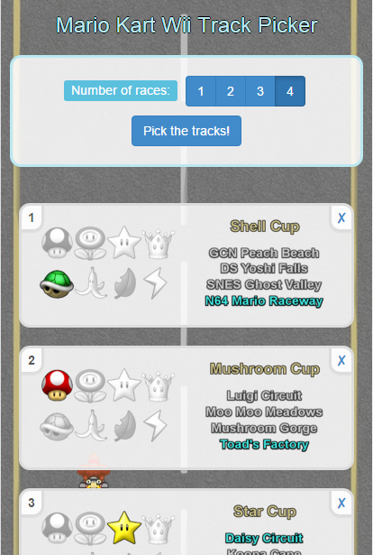

Mario Kart Wii Random Track Picker
==================================

When you play a tournament in Mario Kart on the Wii, there is no option for "Random" when the time comes to pick a cup and track.

This handy little app fills that gap, complete with the ability to veto a track.

[https://mkart.azurewebsites.net/](Try it)

Why
---

Apart from the obvious need to solve this horrendous first-world problem, I also wanted to try out some new tech.

- Google [https://developer.chrome.com/multidevice/android/installtohomescreen](Homescreen-installed apps.)  
  If you visit the app a couple of times with Chrome for Android, the browser will suggest you install it to your homescreen. Once you have done so, it will work offline and look and feel like a real app. This ability is granted by the user of https, a service worker, mobile-friendly design and the inclusion of manifest.json. You can fast-track the process by accessing "Add to Homescreen" in the chrome menu.

- [http://www.asp.net/vnext](ASP.Net vNext / MVC 6). 
  Microsoft has opened their web development platform right up, and I have been suitably impressed by how easy Visual Studio 2015 makes it to use open-source web tech.

Made with Typescript and Angular.js

### Roadmap:

- [DONE] Complete UI
- [DONE] Get dynamic image preloading to work on IIS Express.
- Get dynamic image preloading to work on Azure.
- Enable seamless updates of the offline experience.
- Figure out way to make the app aware of whether it's loaded from the homescreen, and add a custom "install to homescreen" button.
- Apply some gulpfile.js best practices.

